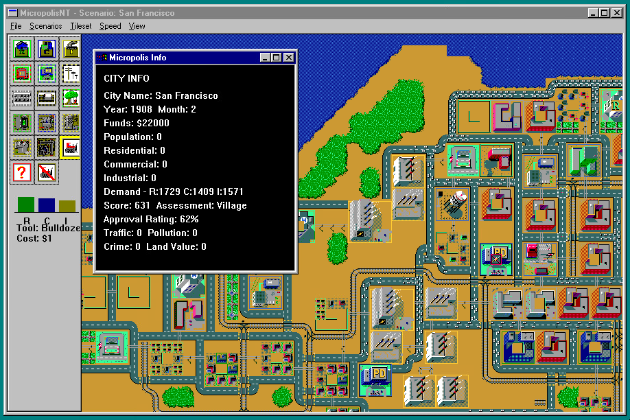

# MicropolisNT

A port of the classic [Micropolis](https://github.com/SimHacker/micropolis) (aka SimCity) game to Windows (Win32) using GDI graphics. The primary objective is to make the game playable on NT RISC machines like Alpha AXP, MIPS, PPC and ARM.

--------------

This game is not fully working yet. There are major features missing, see [TODO](TODO.md) for details. Work is in progress. PRs welcome!

Special thanks to Neozeed and Roytam for major fixes!

--------------

## License

MicropolisNT is licensed under the GNU General Public License version 3 (GPL-3.0) with the additional terms per section 7 as established by Electronic Arts when releasing the original Micropolis code as open source. See the [LICENSE](LICENSE) file for the full text.

## Prior art and attribution

MicropolisNT is based on the following prior art and open-source projects:

- **SimCity** - Created by Will Wright and published by Maxis in 1989. Later ported to Unix platforms by [DUX Software](https://web.archive.org/web/19970714233606/http://www.dux.com/simctyux.html), and finally released as open source by Electronic Arts for the [One Laptop Per Child program](https://wiki.laptop.org/go/Micropolis).
- **Micropolis** - The original open-source release of Micropolis by Don Hopkins and Electronic Arts, https://github.com/SimHacker/micropolis | https://www.donhopkins.com/home/micropolis/
- **MicropolisActivity** - Micropolis Activity | https://github.com/SimHacker/micropolis/tree/master/micropolis-activity
- **MicropolisCore** - Micropolis C++ Core | https://github.com/SimHacker/MicropolisCore
- **MicropolisJS** - A JavaScript port of Micropolis, https://github.com/graememcc/micropolisJS
- **Micropolis Unity** - A Unity port of Micropolis, https://github.com/bsimser/Micropolis
- **Micropolis for Windows** - A Windows 10 port of Micropolis, https://github.com/andreasbalzer/MicropolisForWindows

All code and assets from these projects have been used in accordance with their respective licenses, which are primarily GPL-3.0 with the EA additional terms. This project maintains the same licensing terms.
