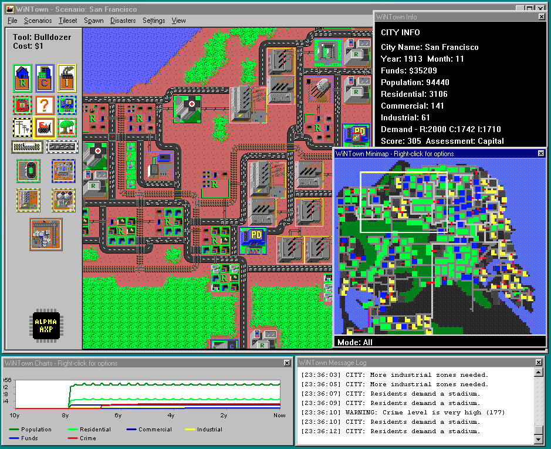

# WiNTown

Back port of the classic [Micropolis](https://github.com/SimHacker/micropolis) (aka SimCity) game to Windows. The primary goal is to make the game playable on NT RISC machines like Alpha AXP, MIPS, PPC, IA64 and ARM.

--------------

**WIP: The game is playable but not fully finished and has [bugs](TODO.md).**

The game is under active development. PRs welcome!

Special thanks to Neozeed and Roytam for major fixes!

--------------

## License

WiNTown is licensed under the GNU General Public License version 3 (GPL-3.0) with the additional terms per section 7 as established by Electronic Arts when releasing the original Micropolis code as open source. See the [LICENSE](LICENSE) file for the full text.

## Prior art and attribution

WiNTown is based on the following prior art and open-source projects:

[SimCity](https://en.wikipedia.org/wiki/SimCity_(1989_video_game)) Created by Will Wright and published by Maxis in 1989. Later ported to Unix platforms by [DUX Software](https://web.archive.org/web/19970714233606/http://www.dux.com/simctyux.html), and finally opensourced by Electronic Arts and released by [Don Hopkins](https://www.donhopkins.com/home/micropolis/) for the [One Laptop Per Child program](https://wiki.laptop.org/go/Micropolis) | [Micropolis](https://github.com/SimHacker/micropolis) | [MicropolisActivity](https://github.com/SimHacker/micropolis/tree/master/micropolis-activity) | [MicropolisCore](https://github.com/SimHacker/MicropolisCore) | [MicropolisJS](https://github.com/graememcc/micropolisJS)

All code and assets from these projects have been used in accordance with their respective licenses, which are primarily GPL-3.0 with the EA additional terms. This project maintains the same licensing terms.
